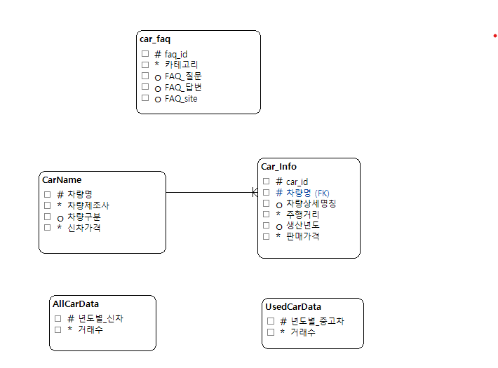

# SK네트웍스 Family AI 캠프 19기 1차 프로젝트

## 1. 팀 소개

### 팀명: **3Team**

### 팀 프로필
<table>
<tr>
<td align="center" width="200" style="vertical-align: top; height: 300px;">

 
<h3 style="margin: 10px 0 5px 0;">박준영</h3>

역할 | DB 구축 

 

</td>
<td align="center" width="200" style="vertical-align: top; height: 300px;">

 
<h3 style="margin: 10px 0 5px 0;">정종현</h3>

역할 | PM 

 

</td>
<td align="center" width="200" style="vertical-align: top; height: 300px;">

 
<h3 style="margin: 10px 0 5px 0;">김진</h3>

역할 | 크롤링 

 

</td>
<td align="center" width="200" style="vertical-align: top; height: 300px;">

 
<h3 style="margin: 10px 0 5px 0;">김지훈</h3>

역할 | UI 

 

</td>
</tr>
</table>

---

## 2. 프로젝트 개요

### 프로젝트명
**중고 자동차 구매 고려 고객을 위한 정보 정보 조회 서비스**

### 프로젝트 소개
데이터 기반 중고차 구매 의사결정 지원을 위한 Streamlit 기반 웹 서비스, 중고차 시장 분석과 실시간 정보 조회 서비스를 제공

### 프로젝트 필요성(배경)
- 최근 8년간 신차 등록 증가율은 감소하는 반면, 중고차 거래량은 꾸준히 증가
- 중고차 시장의 중요성이 커지고 있지만, 객관적이고 종합적인 정보 보기 힘듬
- 차량을 잘 모르는 사람들이 선택하기에는 너무나도 방대한 데이터
- 브랜드별, 차종별 분석 데이터의 체계적 제공 필요성

### 프로젝트 목표
- **데이터 기반 가성비 분석**: 알고리즘을 통한 가성비 지수 계산 및 TOP 10 추천
- **실시간 차량 정보 조회**: 6,485개 중고차 매물 검색 및 필터링 기능
- **시장 트렌드 분석**: 연도별 중고차 시장 동향 및 브랜드별 통계 제공
- **통합 FAQ 서비스**: 현대/기아 공식 FAQ 218개 통합 검색 시스템

---

## 3. 기술 스택

### Frontend

### Backend & Database

### Data Processing & Analysis

### Web Scraping

---

## 4. WBS (작업별 분해 구조)

### 1단계: 데이터 수집 및 전처리
| 작업명 | 담당자 | 기간 | 상태 |
|--------|--------|------|------|
| - | - | - | ✅  |
| - | - | - | ✅  |
| - | - | - | ✅  |
| - | - | - | ✅  |

### 2단계: 데이터베이스 설계 및 구축
| 작업명 | 담당자 | 기간 | 상태 |
|--------|--------|------|------|
| - | - | - | ✅  |
| - | - | - | ✅  |
| - | - | - | ✅  |

### 3단계: 웹 서비스 개발
| 작업명 | 담당자 | 기간 | 상태 |
|--------|--------|------|------|
| - | - | - | ✅  |
| - | - | - | ✅  |
| - | - | - | ✅  |
| - | - | - | ✅  |
| 작업명 | 담당자 | 기간 | 상태 |
|--------|--------|------|------|
| - | - | - | - |
| - | - | - | ✅  |
| - | - | - | ✅  |

---

## 5. 요구사항 명세서

### 주요 기능

#### 가성비 분석 기능
- 신차 가격, 중고차 가격, 연식, 주행거리, 인기도를 종합한 점수 계산
- 100점 만점 기준 가성비 TOP 10 차량 추천

#### 차량 검색 및 필터링
- 브랜드, 차종, 연식, 가격, 주행거리 범위별 다중 검색
- 페이지네이션을 통한 효율적 결과 표시

#### 데이터 분석 대시보드
- 브랜드별/연식별/차량종류별 통계 분석
- 인터랙티브 차트 및 시각화

#### 통합 FAQ 시스템
- 현대/기아 218개 FAQ 통합 검색
- 카테고리별 분류 및 키워드 하이라이팅

### 기술적 요구사항
- 데이터 처리량: 약 7,000개 중고차 매물 데이터베이스 구축
- 실시간 크롤링: Selenium을 사용한 동적 웹페이지 데이터 수집
  

---

## 6. ERD

  
   
  <i>데이터베이스 테이블 간의 관계도</i>

### 테이블 관계 설명

- **CarName** → **Car_Info**: 1:N 관계 (차량 기본정보 - 중고차 매물정보)

- **car_faq**: FAQ 정보 독립 테이블 (현대/기아 통합)

- **AllCarData**: 전체 차량 등록 통계 데이터

- **UsedCarData**: 중고차 거래량 링)
> 

### 김지훈 (UI)
> 

---

## 프로젝트 Repository
**GitHub**: [SKN19-1st-3Team](https://github.com/SKNETWORKS-FAMILY-AICAMP/SKN19-1st-3Team)
