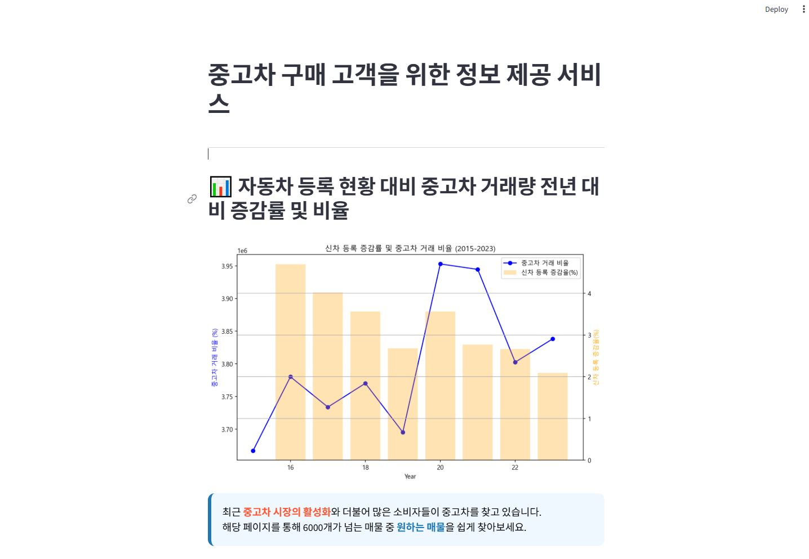
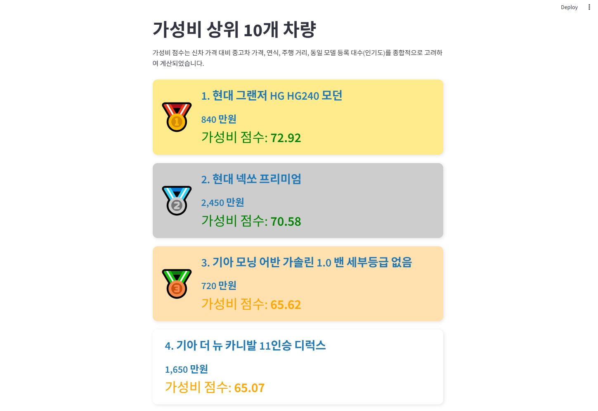
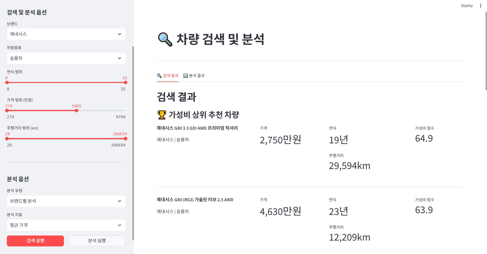
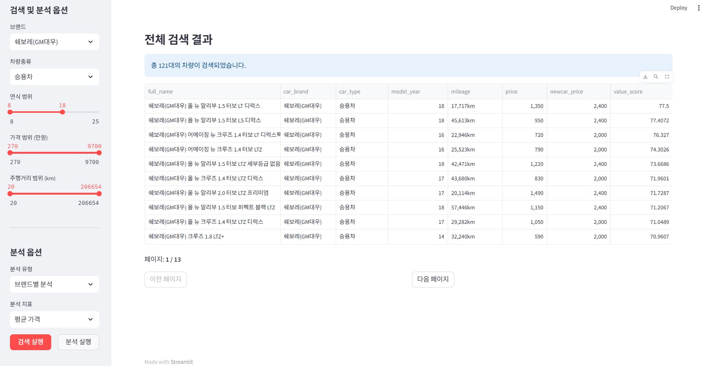
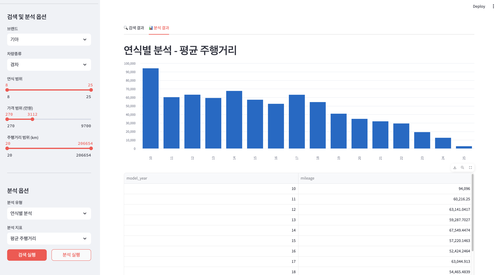
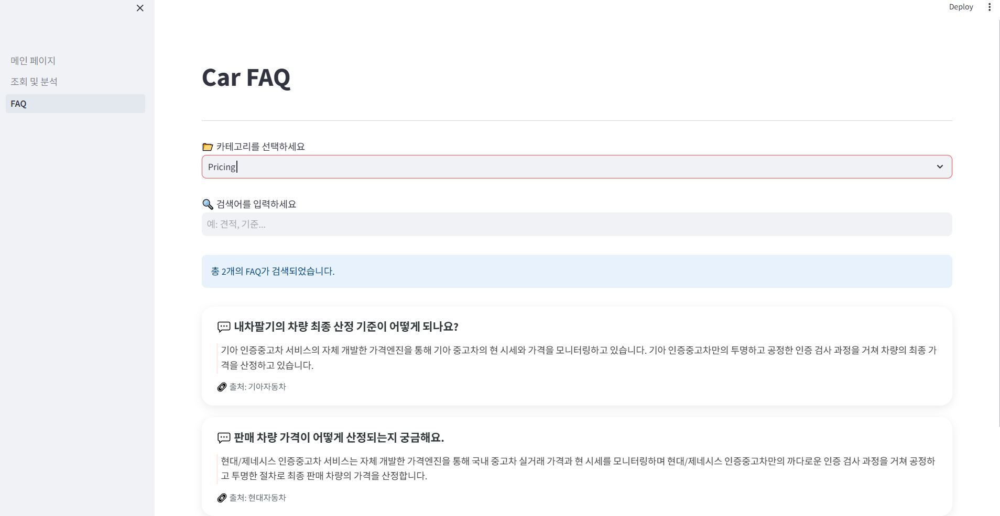

# SK네트웍스 Family AI 캠프 19기 1차 프로젝트

## 1. 팀 소개

### 팀명: **3Team**

### 팀 프로필
<table>
<tr>
<td align="center" width="200" style="vertical-align: top; height: 300px;">

<br />
<h3 style="margin: 10px 0 5px 0;">박준영</h3>
<p style="margin: 5px 0;">역할 | DB</p>
<div style="margin-top: 10px;">
<a href="https://github.com/deneb784">

</a>
<br />
<a href="mailto:deneb784@gmail.com">

</a>
</div>
</td>
<td align="center" width="200" style="vertical-align: top; height: 300px;">

<br />
<h3 style="margin: 10px 0 5px 0;">정종현</h3>
<p style="margin: 5px 0;">역할 | PM</p>
<div style="margin-top: 10px;">
<a href="https://github.com/myem21">

</a>
<br />
<a href="mailto:myem21@gmail.com">

</a>
</div>
</td>
<td align="center" width="200" style="vertical-align: top; height: 300px;">

<br />
<h3 style="margin: 10px 0 5px 0;">김진</h3>
<p style="margin: 5px 0;">역할 | 크롤링</p>
<div style="margin-top: 10px;">
<a href="https://github.com/KIMjjjjjjjj">

</a>
<br />
<a href="mailto:jin432101@gmail.com">

</a>
</div>
</td>
<td align="center" width="200" style="vertical-align: top; height: 300px;">

<br />
<h3 style="margin: 10px 0 5px 0;">김지훈</h3>
<p style="margin: 5px 0;">역할 | UI/UX</p>
<div style="margin-top: 10px;">
<a href="https://github.com/ddeeqq">

</a>
<br />
<a href="mailto:jihanki3@naver.com">

</a>
</div>
</td>
</tr>
</table>

---

## 2. 프로젝트 개요

### 프로젝트명
**중고 자동차 정보 조회 서비스**

### 프로젝트 소개
데이터 기반 중고차 구매 의사결정 지원을 위한 Streamlit 기반 웹 서비스로, 중고차 시장 분석과 실시간 정보 조회 서비스를 제공합니다.

### 프로젝트 필요성(배경)
- 최근 8년간 신차 등록 증가율은 감소하는 반면, 중고차 거래량은 꾸준히 증가
- 중고차 시장의 중요성이 커지고 있지만, 객관적이고 종합적인 정보 부족
- 소비자들이 중고차 구매 시 가성비와 적정 시세를 판단하기 어려움
- 브랜드별, 차종별 분석 데이터의 체계적 제공 필요성

### 프로젝트 목표
- **데이터 기반 가성비 분석**: 독자적 알고리즘을 통한 가성비 지수 계산 및 TOP 10 추천
- **실시간 차량 정보 조회**: 6,485개 중고차 매물 검색 및 필터링 기능
- **시장 트렌드 분석**: 연도별 중고차 시장 동향 및 브랜드별 통계 제공
- **통합 FAQ 서비스**: 현대/기아 공식 FAQ 218개 통합 검색 시스템

---

## 3. 기술 스택

### Frontend


### Backend & Database


### Data Processing & Analysis


### Web Scraping


---

## 4. WBS (작업별 분해 구조)

<!-- 복붙 -->
---

## 5. 요구사항 명세서

### 주요 기능

#### 가성비 분석 기능
- 신차 가격, 중고차 가격, 연식, 주행거리, 인기도를 종합한 점수 계산
- 100점 만점 기준 가성비 TOP 10 차량 추천

#### 차량 검색 및 필터링
- 브랜드, 차종, 연식, 가격, 주행거리 범위별 다중 검색
- 페이지네이션을 통한 효율적 결과 표시

#### 데이터 분석 대시보드
- 브랜드별/연식별/차량종류별 통계 분석
- 인터랙티브 차트 및 시각화

#### 통합 FAQ 시스템
- 현대/기아 218개 FAQ 통합 검색
- 카테고리별 분류 및 키워드 하이라이팅

### 기술적 요구사항
- 데이터 처리량: 약 7,000개 중고차 매물 데이터베이스 구축
- 실시간 크롤링: Selenium 기반 K-Car 매물 정보 자동 수집

---

## 6. ERD

<div align="center">
  
  <br>
  <i>데이터베이스 테이블 간의 관계도</i>
</div>

### 테이블 관계 설명

- **CarName** → **Car_Info**: 1:N 관계 (차량 기본정보 - 중고차 매물정보)

- **car_faq**: FAQ 정보 독립 테이블 (현대/기아 통합)

- **AllCarData**: 전체 차량 등록 통계 데이터

- **UsedCarData**: 중고차 거래량 통계 데이터

### 주요 테이블 구조

#### CarName 테이블
```sql
CREATE TABLE CarName (
    car_name VARCHAR(50) PRIMARY KEY,
    car_brand VARCHAR(50) NOT NULL,
    car_type ENUM('경차', '승용차', 'SUV', '승합차', '트럭'),
    newcar_price INT NOT NULL
);
```
**데이터**: 67개 차종  
**주요 컬럼**: 브랜드, 차종, 차량종류, 신차가격

#### CarInfo 테이블  
```sql
CREATE TABLE CarInfo (
    car_ID INT AUTO_INCREMENT PRIMARY KEY,
    car_name VARCHAR(50),
    full_name VARCHAR(100) NOT NULL,
    mileage INT,
    model_year INT,
    price INT NOT NULL,
    FOREIGN KEY (car_name) REFERENCES CarName(car_name)
);
```
**데이터**: 6,485개 중고차 매물  
**주요 컬럼**: 차종, 차량명, 연식, 주행거리, 가격

#### car_faq 테이블
```sql
CREATE TABLE car_faq (
    faq_id INT AUTO_INCREMENT PRIMARY KEY,
    category VARCHAR(50) NOT NULL,
    question TEXT NOT NULL,
    answer TEXT NOT NULL,
    site VARCHAR(100)
);
```
**데이터**: 218개 FAQ (현대 132개 + 기아 86개)  
**주요 컬럼**: 카테고리, 질문, 답변, 출처사이트

#### UsedCarData 테이블
```sql
CREATE TABLE UsedCarData (
    yearNum INT PRIMARY KEY,
    total_transactions INT NOT NULL
);
```
**데이터**: 9년간 데이터 (2015-2023)  
**주요 컬럼**: 연도, 중고차 총거래대수

#### AllCarData 테이블
```sql
CREATE TABLE AllCarData (
    yearNum INT PRIMARY KEY,
    total_transactions INT NOT NULL
);
```
**데이터**: 9년간 데이터 (2015-2023)  
**주요 컬럼**: 연도, 전체차량 총거래대수

---


## 7. 수행결과 (테스트/시연 페이지)

### 메인 페이지 - 가성비 분석

<div align="center">
  
  <br>
  <i>자동차 등록 현황 대비 중고차 거래량 분석</i>
</div>

<div align="center">
  
  <br>
  <i>가성비 상위 10개 차량</i>
</div>


**주요 기능**:
- 2015-2023년 시장 트렌드 분석 그래프 (신차 vs 중고차)
- 가성비 지수 계산을 통한 TOP 10 차량 추천
- 실시간 업데이트되는 가성비 점수 (100점 만점)

---

### 차량 조회 및 분석 페이지

<div align="center">
  
  <br>
  <i>다중 필터 기반 차량 검색 시스템1 </i>
</div>

<div align="center">
  
  <br>
  <i>다중 필터 기반 차량 검색 시스템2 </i>
</div>

<div align="center">
  
  <br>
  <i>연식별 평균 주행거리 분석 차트</i>
</div>

**주요 기능**:
- 브랜드, 차종, 연식, 가격, 주행거리별 다중 필터링
- 가성비 상위 추천 차량 우선 표시
- 브랜드별/연식별/차량종류별 인터랙티브 분석 차트

---

### FAQ 페이지

<div align="center">
  
  <br>
  <i>현대/기아 통합 FAQ 검색 시스템</i>
</div>

**주요 기능**:
- 현대자동차, 기아자동차 공식 FAQ 통합
- 카테고리별 분류 (Pricing, 내차팔기, 방문평가 등)
- 키워드 검색 및 하이라이팅 기능
- 출처 정보 명시로 신뢰성 확보

---

### 기술적 성과

- **데이터 수집**: K-Car에서 6,485개 중고차 매물 자동 수집
- **FAQ 통합**: 현대(132개) + 기아(86개) = 218개 FAQ 통합
- **가성비 알고리즘**: 4개 지표(가격, 연식, 주행거리, 인기도) 기반 점수 계산
- **실시간 분석**: MySQL 기반 브랜드별/연식별 통계 분석
- **사용자 경험**: Streamlit을 활용한 직관적 UI/UX 구현

---

## 9. 한 줄 회고

### 박준영 (DB)
> 협업을 통해 구현한 기능의 모듈화, 호환성 에 대해 고려하고 서로 다른 os와 디바이스에서 동일하게 작동하도록 하는 데이터베이스와 프로그램의 구축을 실천해보며 많은 깨달음을 얻을 수 있었다.

### 정종현 (팀장)
> 가상의 고객이 다양한 case별 필요 데이터를 제공해 주는 것이 매우 어려웠지만, 각 팀원이 가상의 고객 입장에서 필요한 정보(알고 싶은 정보)를 제공해 준다는 기준으로 작업할 수 있었습니다. 어려운 상황에 최적의 상황으로 전환할 수 있는 다양한 경험이 많이 필요하다고 느꼈습니다.

### 김진 (크롤링)
> 

### 김지훈 (UI/UX)
> 필요할 데이터가 어떤 의미인지 모르고 화면을 구성한다는 것이 너무 어려웠습니다. 하지만, 관련 화면의 벤치마킹으로 최대한 직관적인 화면이 되도록 만들어 보았습니다. 필요한 Data를 만드는 것 뿐만 아니라, 그 Data에 어떤 의미가 있는지 부여하는 화면 작업은 새로운 경험이 되었습니다.

---

## 프로젝트 Repository
**GitHub**: [SKN19-1st-3Team](https://github.com/SKNETWORKS-FAMILY-AICAMP/SKN19-1st-3Team)
